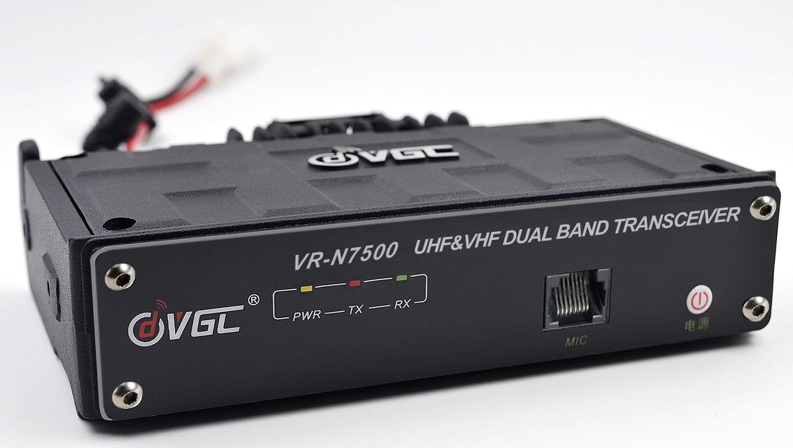

.. VR-N7500 documentation master file, created by
   sphinx-quickstart on Thu Aug 13 20:01:55 2020.
   You can adapt this file completely to your liking, but it should at least
   contain the root `toctree` directive.

Willkommen zur inoffiziellen Dokumentation des VR-N7500
=======================================================

VGC VR-N7500 ist ein voll ausgestattetes Dualband-Mobilfunkgerät das mittels Smartphone (Andorid oder iPhone) über Bluetooth gesteurt wird. Ein klassisches Bedienteil gibt es nicht. Es lässt sich diskret und völlig unsichtbar im Fahrzeug installieren und mit einer Bluetooth Freisprechverbindung verbinden.

Hier eine Übersicht der Features:

  * bis zu 40W auf UHF und 50W auf VHF bei
  * verschiedenen Regionen mit 16 Kanälen pro Region
  * APRS-Fähigkeit
  * Morse-Code-Encoder/Decoder (Nur Android)
  * SSTV Encoder/Decoder (Nur Android)
  * Kabel Mikrofon
  * Bluetooth PTT
  * Bluetooth Mikrofon

.. toctree::
   :maxdepth: 2
   :caption: Inhalt:

   android
   iphone

